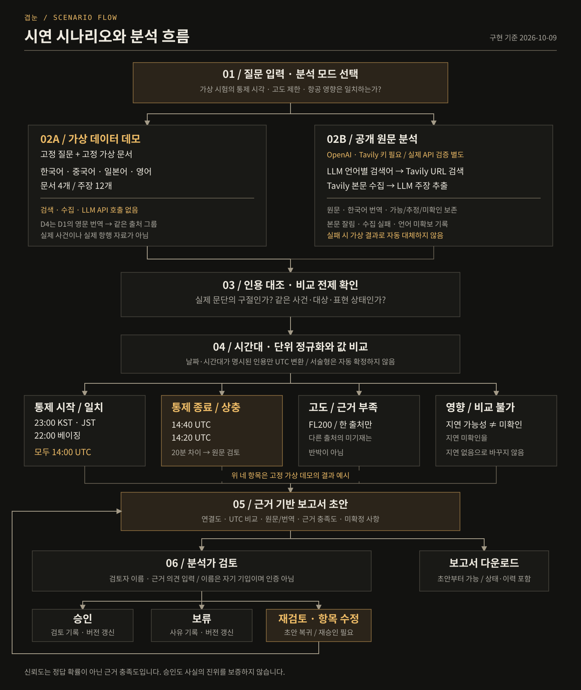
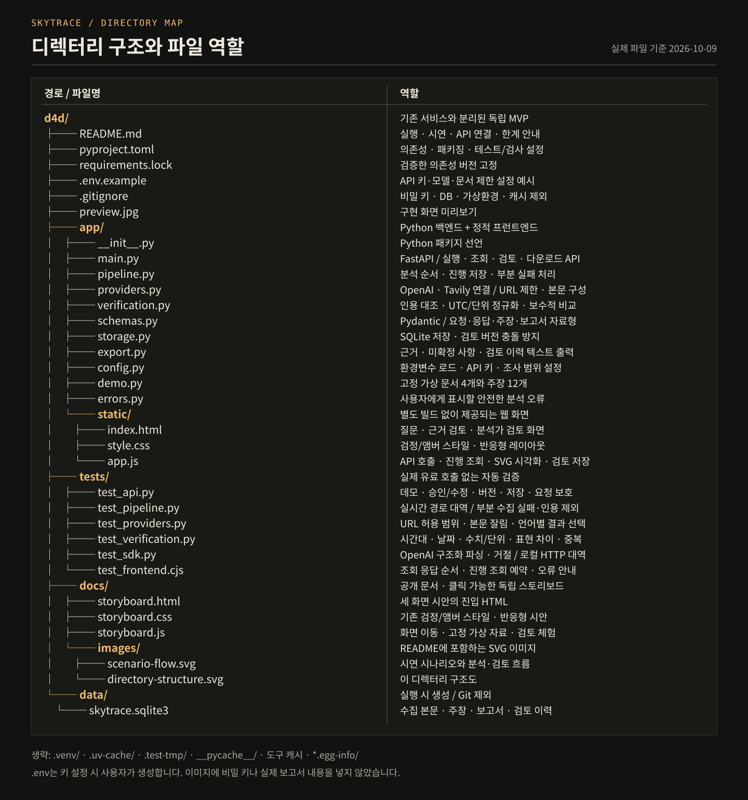

# 겹눈 APAC MVP

최신성 체크: 2026-10-10 로컬 코드·테스트·Ollama 설치 상태 확인 기준. API 제공사 정책·요금의 변경일을 의미하지 않습니다.

다국어 공개 원문을 주장 단위로 나눠 시각·단위를 맞추고 원문 근거와 함께 검토하는 **로컬 단일 사용자 앱**입니다.

LLM은 **Ollama로 로컬 시연을 먼저 해보는 방향**입니다. 현재 PC에는 Ollama와 모델이 준비돼 있지만 앱 연결은 아직 하지 않았습니다. 기존 OpenAI 연동 코드가 그대로 동작하므로, 아래에서 개발 방향과 현재 실행 경로를 구분합니다.

## 현재 상태

| 구분 | 현재 동작 |
| --- | --- |
| 실제 앱 | FastAPI·SQLite. 가상 데모, 근거 비교, 보고서 다운로드, 검토·승인 구현 |
| 공개 원문 분석 | OpenAI와 Tavily 연동 코드 구현. 두 API 키 필요. 실제 원문 분석 품질은 미검증 |
| 스토리보드 | 지도·타임라인·기관별 관점 비교를 체험하는 별도 가상 시안. 실제 앱과 연결되지 않음 |
| 로컬 LLM | Ollama `0.40.2`·`qwen3:4b` 설치와 로컬 API 응답 확인. 로컬 시연 우선 방향이나 앱 연결은 미구현 |
| RAG·벡터 DB | 미구현. 수집한 문서를 바로 추출·비교하는 파이프라인만 있음 |
| 수집 파이프라인 설계 | [설계 문서](docs/collection-pipeline-design.md)는 제안 단계. 출처별 어댑터·독립성 판정 설계 전체를 구현한 상태는 아님 |

대만해협·남중국해·태국–캄보디아 국경 분쟁은 시연 후보입니다. 현재 가상 데모는 항공 통제 공지 비교이며, 실제 사건의 수집·비교 결과로 소개하면 안 됩니다.

## Ollama 로컬 LLM 준비와 실행

### 현재 PC에서 확인한 상태

| 항목 | 2026-10-10 확인 결과 |
| --- | --- |
| 실행 파일 | `C:\Users\INA\AppData\Local\Programs\Ollama\ollama.exe` |
| Ollama 버전 | 로컬 `/api/version` 응답 `0.40.2` |
| 다운로드된 모델 | 로컬 `/api/tags` 목록의 `qwen3:4b`, 양자화 `Q4_K_M` |
| 모델 저장 경로 | 사용자 환경변수 `OLLAMA_MODELS=D:\AI\ollama-models` |
| 로컬 서버 | `http://127.0.0.1:11434`의 버전·모델 목록 요청에 HTTP 200 응답 |
| 앱 연결 | 미구현. 현재 `app/providers.py`는 OpenAI를 호출 |

이 표는 현재 작업 PC의 상태입니다. 다른 팀원의 PC에도 같은 모델이 설치됐다는 뜻은 아닙니다. 실행 파일은 C 드라이브에 있고 모델 저장 경로만 D 드라이브로 설정돼 있습니다. 이번 확인은 서버 응답과 모델 목록까지이며, 추론 속도·다국어 추출 정확도는 검증하지 않았습니다.

### 앱과 별도로 Ollama 확인하기

PowerShell에서 버전·모델·저장 경로를 확인합니다. API 키는 필요하지 않습니다.

```powershell
ollama --version
ollama list
[Environment]::GetEnvironmentVariable("OLLAMA_MODELS", "User")
Invoke-RestMethod -Uri http://127.0.0.1:11434/api/version
(Invoke-RestMethod -Uri http://127.0.0.1:11434/api/tags).models |
    Select-Object name, size
```

모델 자체를 대화형으로 시험하려면 다음 명령을 사용하세요. 겹눈의 분석 파이프라인이나 보고서를 실행하는 명령은 아닙니다.

```powershell
ollama run qwen3:4b
```

다른 PC에서 모델이 없다면 `ollama pull qwen3:4b`로 다운로드할 수 있습니다. 모델 저장 위치를 바꿀 때는 사용자 환경변수 `OLLAMA_MODELS`를 설정한 뒤 실행 중인 Ollama를 종료하고 다시 시작해야 합니다. 이미 로컬 서버가 실행 중이면 `ollama serve`를 중복 실행하지 마세요. ([Ollama Windows 안내](https://docs.ollama.com/windows), [로컬 API 안내](https://docs.ollama.com/api/introduction))

### 테스트 기준과 소스 변경 순서

현재 자동 테스트는 **기존 앱 코드 기준**으로 구성돼 있습니다. OpenAI·Tavily 호출은 테스트 대역으로 검사하며, 가상 데모·근거 비교·저장·검토 흐름을 검증합니다. 이 테스트가 통과했다고 Ollama 모델의 실제 추론이나 앱 연결까지 검증된 것은 아닙니다.

다음 순서로 진행할 예정입니다.

1. 프로젝트 담당자(사용자)가 Ollama를 앱과 별도로 실행해 로컬 테스트를 마칩니다. 확인할 항목은 응답 속도·구조화 JSON·다국어 주장 추출·원문 인용 보존입니다.
2. 로컬 테스트가 끝난 뒤 **담당자가 결과를 바탕으로 앱 소스를 다시 수정**해 LLM 호출을 Ollama로 연결할 예정입니다. 현재 소스는 기존 OpenAI 경로를 유지합니다.
3. 소스를 바꾼 뒤 기존 회귀 테스트를 다시 실행하고, Ollama와 연결한 앱의 분석·보고서 흐름도 별도로 확인합니다.

로컬 테스트와 이후 소스 변경은 아직 완료된 작업으로 표시하지 않습니다. 현재 준비 상태와 자동 테스트 결과는 위 단계의 완료 여부와 구분해서 읽어야 합니다.

### 앱에 연결할 때 남은 작업

- 언어별 검색 계획과 주장 추출의 LLM 호출을 Ollama로 연결합니다. Tavily 검색·본문 수집은 유지합니다. LLM을 로컬로 바꿔도 검색어·URL이 Tavily로 전달되므로 전체 시스템이 오프라인이 되는 것은 아닙니다.
- Ollama에 JSON Schema를 전달하고 응답을 기존 Pydantic 자료형으로 검사합니다. JSON 형식이 맞는 것과 원문 근거가 맞는 것은 별개라 인용·날짜·단위 검사를 그대로 둡니다. ([Ollama 구조화 출력](https://docs.ollama.com/capabilities/structured-outputs))
- 로컬 추론의 시간 제한·취소·토큰 집계를 실제 응답에 맞춥니다. 현재 OpenAI용 제한 시간이 로컬 모델에도 적절한지는 별도로 측정합니다. 실패하면 OpenAI로 자동 전환해 크레딧을 쓰지 않습니다.
- 기존 근거 비교·템플릿 보고서·분석가 검토를 유지한 채 가상 자료와 실제 공개 원문으로 연결을 확인합니다. 로컬 모델의 문장 생성이 사실 판정을 대신하지 않게 합니다.

현재 설정에는 Ollama 서버 주소나 모델을 선택하는 앱 옵션이 없습니다. `OPENAI_MODEL`에 `qwen3:4b`를 넣거나 Ollama만 실행해도 앱의 호출 경로가 로컬로 바뀌지 않습니다. Ollama 설치는 RAG·벡터 DB·로컬 자동 보고서 연결 완료를 뜻하지 않습니다.

## 검색 조건과 출처 계획 — 미구현

실제 앱은 `question`, `mode`, `languages`만 받습니다. 아래 선택 항목은 구현 예정이며 현재 검색을 바꾸지 않습니다. 시안의 기관 소재 지역·비교 내용은 고정 태그이고 사건·기간 입력은 읽기 전용입니다. 시안의 출처·언어 선택도 실제 검색이나 자료 필터링에는 연결되지 않았습니다.

| 선택 항목 | 예정 동작 |
| --- | --- |
| 기관 소재 지역 | 중국·대만·필리핀·태국·캄보디아를 다중 선택하고 등록된 기관 목록을 좁힘. 일본은 보조 출처 |
| 수집 출처 | 국방·외교·해경 기관, 제3자 언론, 확인된 공식 SNS를 구분 |
| 비교할 내용 | 공통 사실 주장 / 기관별 해석 / 지역별 상황을 다중 선택 |
| 사건 범위 | 대만해협·남중국해·태국–캄보디아 국경 주제 중 하나를 고르고, 같은 사건의 이름·대상·지역을 지정 |
| 사건 발생 기간 | 시작·종료 날짜 지정. 원문에 명시된 사건 날짜로 범위 판정 |
| 검색 자료 기간 | 전체 / 최근 24시간·3일·7일 / 직접 지정. 게시일·수정일 기준 검색 기간 |

기관 소재 지역은 발표 기관의 위치를 뜻합니다. 문서 언어와 사건 발생 지역은 별개입니다. 영어로 작성된 중국 기관의 발표를 영국·미국 출처로 분류하지 않습니다.

공통 사실 주장은 같은 사건·대상·지역·시간·단위가 맞을 때만 기존 값 비교를 씁니다. 기관별 해석은 관점 차이를 보여주고 지역별 상황은 지역별 자료를 나란히 놓을 계획입니다. 이를 자동 진위 판정이나 서로 모순되는 값으로 처리하지 않습니다. 같은 주제의 여러 사건을 한 번에 묶는 비교 엔진은 구현하지 않았습니다.

자료 검색 기간과 사건 발생 기간은 서로 대신하지 않습니다. Tavily 날짜 조건은 게시일 또는 마지막 수정일 기준이며, 날짜가 없는 결과도 남을 수 있습니다. 사건 날짜가 원문에 없으면 기간을 추정하지 않고 ‘기간 미확인’으로 구분해야 합니다. 날짜 필터만으로 정확한 최근 24시간 범위를 보장하지 않습니다. ([Tavily 검색 문서](https://docs.tavily.com/documentation/api-reference/endpoint/search))

### 시연 주제별 화이트리스트 등록 후보

| 시연 주제 | 당사자 발표 출처 후보 |
| --- | --- |
| 대만해협 | [대만 국방부](https://www.mnd.gov.tw/) `mnd.gov.tw` ↔ [중국 국방부](https://eng.mod.gov.cn/2025xb/A_251795/index.html) `mod.gov.cn`, [중국 외교부](https://www.fmprc.gov.cn/) `fmprc.gov.cn` |
| 남중국해 | [중국 해경국](https://www.ccg.gov.cn/wqzf/) `ccg.gov.cn` ↔ [필리핀 해안경비대](https://www.coastguard.gov.ph/index.php/careers/11-news/5001-pcg-statement-on-chinese-vessel-using-laser-at-pcg-ship-in-ayungin) `coastguard.gov.ph` |
| 태국–캄보디아 국경 | [태국 외교부](https://www.mfa.go.th/en/) `mfa.go.th` ↔ [캄보디아 외교·국제협력부](https://www.mfaic.gov.kh/) `mfaic.gov.kh` |

위 목록은 등록 후보이며, 현재 앱에 모두 등록된 화이트리스트가 아닙니다. 특히 `mnd.gov.tw`·`ccg.gov.cn`·`coastguard.gov.ph`·`mfa.go.th`·`mfaic.gov.kh`는 현재 기본 허용 목록에 없습니다. 현재 적용 목록은 `app/config.py`와 `SKYTRACE_ALLOWED_DOMAINS`에서 확인하세요.

2026-10-10 공식 사이트·검색 색인 확인 기준입니다. 대만 국방부·중국 외교부·중국 해경국·태국 외교부는 웹 본문을 확인했습니다. 중국 국방부·필리핀 해안경비대는 검색 색인에서 공식 자료를 확인했지만 직접 본문 열기에 실패했고, 캄보디아 외교부는 직접 접속이 거절됐습니다. 이 확인은 Tavily 자동 추출 성공을 의미하지 않습니다. 필리핀 링크는 기관의 자료 유형을 확인하는 과거 성명이며 이번 시연 사건의 근거가 아닙니다.

화이트리스트는 기관 ID·소재 지역·출처 유형·허용 호스트·확인된 별칭을 목록 하나에 모아 관리할 예정입니다. 서버가 선택 조건을 허용 호스트로 바꾸고 검색과 수집 URL 재검사에 같은 범위를 적용하도록 합니다. 같은 기관의 번역·재게시 도메인은 같은 그룹으로 묶되, 서로 다른 기관 그룹이 독립 근거라는 보장은 하지 않습니다.

Reuters·AP는 보조 언론으로 구분하고 SNS는 확인된 공개 계정만 후보에 넣을 계획입니다. 계정이 공식이라는 사실과 게시 내용의 사실성은 별개입니다. 로그인·접근 제한을 우회하지 않으며 URL 발견·본문 확보·접근 제한을 나눠 표시해야 합니다.

## 실행

Python 3.12 이상, PowerShell 기준. 현재 작업 환경에는 `.venv`가 설치돼 있습니다.

```powershell
cd C:\Users\INA\Documents\workspace\d4d
.venv\Scripts\python.exe -m uvicorn app.main:app --host 127.0.0.1 --port 8766
```

[앱 열기](http://127.0.0.1:8766). 시작 화면의 **가상 데이터 데모**는 API 키 없이 실행됩니다. 임의 질문에 답하는 모드가 아니라 고정된 가상 시나리오입니다.

새 환경에 설치할 때:

```powershell
python -m venv .venv
.venv\Scripts\python.exe -m pip install -e ".[dev]"
```

검증한 버전을 재현하려면 일반 설치 대신 `pip install -r requirements.lock` 후 `pip install --no-deps -e .`를 같은 가상환경에서 실행하세요. lock은 Python 3.12 / Windows 검증 환경 기준입니다.

uv를 쓰는 환경이라면 `uv pip install --python .venv/Scripts/python.exe -e ".[dev]"`도 가능합니다. 다른 프로젝트의 의존성은 변경하지 않습니다.

## 저장소와 커밋 따라가기

저장소 폴더는 `d4d`, 앱 이름은 겹눈입니다. 저장소는 [Ina-dang/d4d](https://github.com/Ina-dang/d4d)에 있습니다. 기존 환경변수·패키지·DB의 `skytrace` 식별자는 호환성을 위해 유지합니다.

`main`은 릴리스, `develop`은 통합 개발, `feature/*`는 기능 개발, `release/*`는 릴리스 준비, `hotfix/*`는 배포 긴급 수정에 사용합니다. 상세 규칙은 [기여 가이드](CONTRIBUTING.md)를 참고하세요.

처음 코드를 볼 때는 아래 명령으로 병합 커밋을 제외한 구현 순서를 확인하세요. 각 커밋 본문에 변경 이유와 읽을 파일을 적습니다.

```powershell
git log --reverse --no-merges --format="%h %s" develop
git show <커밋해시>
```

기초 설정 → 자료형·데모 → 저장·비교 규칙 → 제공사 연동 → 파이프라인 → API → 화면 → 문서 순서로 읽으면 됩니다. 과거의 다른 프로젝트 이력은 이 저장소에 포함하지 않습니다.

## 클릭 가능한 스토리보드 시안

[스토리보드 열기](http://127.0.0.1:8768/storyboard.html) · [시안 파일](docs/storyboard.html)

검색 → Fusion 분석 → 보고서·승인의 세 화면입니다. Fusion 분석은 기관 소재지 배치도·출처 관계망·게시/수집 타임라인과 오른쪽 원문 패널로 구성합니다. 지도 노드, 타임라인, 주장 카드를 선택하면 같은 패널의 원문·번역·추출값이 갱신됩니다. 보고서는 밝은 문서 지면 옆에서 ‘근거 시각화 / 검토·승인’을 전환합니다. 기관별 해석/지역별 상황 및 출처 목록은 분석 안에서 펼칩니다. 전체 보드의 ‘체험’ 링크 또는 ‘직접 둘러보기’로 확인할 수 있습니다.

지도 모양은 기관 소재지를 설명하는 배치도이며 실제 좌표·축척·시험 위치를 표시하지 않습니다. 연결선은 원문 근거 관계이지 비행 경로가 아닙니다. 타임라인은 가상 게시/수집/예정 시각이며 실시간 추적 기능이 아닙니다. 보고서의 막대 길이는 14:00 기준 공지된 통제 기간(40분/20분)을 비교하며, 실제 시행이나 진위 확률을 뜻하지 않습니다.

이 시안은 기존 MVP와 별도입니다. 모든 사건·기관·원문·시각은 가상이며, API 호출·실제 검색·DB 저장·실제 승인에 연결하지 않습니다. 기관별 비교와 관점/지역 차이 구분은 제안 화면입니다. 백엔드에 구현됐다는 뜻은 아닙니다. 검토 이력은 새로고침하면 초기화됩니다.

시안 서버를 따로 실행하려면:

```powershell
.venv\Scripts\python.exe -m http.server 8768 --bind 127.0.0.1 --directory docs
```

서버는 공개 문서와 시안이 있는 `docs/`만 제공합니다. API 키나 결과 DB가 있는 프로젝트 루트를 서버 디렉터리로 지정하지 마세요.

시안은 JavaScript 구문과 세 화면·이전 링크의 통합 렌더링을 검사했습니다. 브라우저에서는 화면 이동, 지도/타임라인 선택, 주장별 원문 패널 갱신, 보고서 도구 전환, 승인/수정 후 재검토 상태를 확인했습니다. 모바일 폭에서도 문서가 가로로 넘치지 않고 출처를 선택해 원문 패널에 접근할 수 있는지 확인했습니다. 이는 시안 검증이며 실제 수집·추출·국가별 비교 엔진의 품질 검증은 아닙니다.

## 현재 앱의 공개 원문 분석 — 기존 OpenAI 경로

아래는 이미 구현된 OpenAI·Tavily 경로의 실행 방법입니다. Ollama 연결 방법이 아니며, 로컬 우선 개발 방향과는 구분해서 읽으세요.

`.env.example`을 같은 폴더의 `.env`로 복사하고 `OPENAI_API_KEY`, `TAVILY_API_KEY`를 직접 입력한 뒤 서버를 재시작하세요. 키를 채팅·프런트엔드·Git에 넣지 마세요. `.env`와 결과 DB는 Git 제외 대상입니다.

키가 없으면 공개 원문 분석을 실행할 수 없습니다. 실제 분석 실패를 가상 결과로 바꾸지 않습니다. 실제 원문 분석은 키와 네트워크를 설정한 뒤 처음부터 끝까지 동작하는지 따로 확인해야 합니다. 현재 실시간 파이프라인 테스트에는 API 대역을 쓰며 유료 API를 호출하지 않았습니다.

실시간 기본 질문은 입력 예시일 뿐, 사건·자료의 존재나 다국어 원문 확보를 보증하지 않습니다. 질문에 민감한 정보를 넣지 마세요. 질문·본문은 OpenAI/Tavily로 전송될 수 있습니다.

## 구현 범위

- 질문 → LLM 언어별 검색어·비교 항목 → Tavily URL 검색 → Tavily 본문 수집 → LLM 구조화 주장 추출.
- 원문 인용 구절과 문단 ID 대조. 원문·한국어 번역·추정/가능/예정/미확인·부정·수량 표현 보존.
- 사건 날짜·대상·표현 상태·단위가 맞는 항목만 수치 비교. 명시적인 전체 날짜와 시간대가 있는 인용만 UTC 정규화. FL은 미터로 환산하지 않음.
- 값 일치 / 값 상충 / 근거 부족 / 직접 비교 불가 / 수정 공지 검토를 구분. 서술형 의미는 자동 진위 판정하지 않고 사람 검토로 남김.
- 주장별 원문→값→판단 연결도, UTC 시각 비교, 원문·번역 나란히 보기.
- SQLite 분석 보관, 항목별 근거 충족도·검토 의견, 승인·보류·재검토, 버전 충돌 방지, 텍스트 보고서 다운로드.
- 항목 수정 시 승인 상태가 초안으로 돌아감. 검토 이력에 변경 전후 충족도와 버전을 남김.

기본 제한: 언어별 검색 1회(최대 4언어), 검색당 최대 3결과, 수집 최대 6문서, 문서당 10,000자, 문서당 주장 최대 6개. 언어별 검색 결과를 번갈아 선택해 한 언어가 문서 예산을 독점하지 않게 하며, 요청 언어의 원문 미확보는 경고로 남깁니다. 검색/LLM 동시 요청 최대 2개, 한 번에 분석 1개, 작업 제한 210초, OpenAI SDK 자동 재시도 없음. 환경변수로 문서 수는 최대 8개, 본문은 최대 16,000자까지 설정할 수 있습니다.

최대 LLM 호출 수 = 검색 계획 1회 + 수집 문서 수(기본 최대 6회) = 기본 최대 7회. 각 호출 출력 상한은 2,800토큰입니다. 비용은 입력 길이·실패·제공사 정책에 따라 달라지므로 **4달러로 가능한 실행 횟수는 보장하지 않습니다.** 화면은 API에서 확인된 토큰만 집계하며 요금·확률로 표시하지 않습니다.

## 데모 시연

### 시나리오 흐름도



가상 데모는 외부 API를 호출하지 않습니다. 그림의 네 가지 비교 결과는 고정 가상 시나리오의 예시이며, 공개 원문 분석의 결과를 미리 정해 둔 것이 아닙니다. 보고서는 초안부터 다운로드할 수 있고, 승인 후 항목을 수정하면 재승인이 필요합니다.

### 시연 순서

1. 가상 데이터 데모 실행. 한국어·중국어·일본어·영어 문서 4개, 주장 12개.
2. 통제 시작: 23:00 KST / 22:00 베이징 / 23:00 JST → 14:00 UTC 일치.
3. 통제 종료: 14:40 UTC와 14:20 UTC → 값 상충, 낮은 근거 충족도.
4. 고도 제한: FL200 근거가 한 출처에만 있음 → 근거 부족. 다른 출처의 미기재는 반박이 아님.
5. 항공 영향: 지연 가능성과 지연 미확인 → 직접 비교 불가. 미확인을 “지연 없음”으로 번역하지 않음.
6. D4는 D1의 영문 번역으로 같은 출처 그룹. 언어 수를 독립 근거 수로 세지 않음.
7. 검토자·의견 입력 → 보류 또는 승인 → 항목 의견 수정 → 초안 복귀와 버전 이력 확인 → 보고서 다운로드.

## 디렉터리 구조



2026-10-10 파일 구성을 그린 그림입니다. 가상환경·캐시 등 실행 중 생기는 파일은 생략했습니다. `data/skytrace.sqlite3`는 실행 시 생성되고 Git에서 제외되며, `.env`는 API 키 설정 시 사용자가 생성합니다. 그림은 SVG 이미지라 확대해도 파일명과 한글이 선명하게 표시됩니다.

현재는 루트의 `app/`를 패키지로 쓰는 평면 레이아웃입니다. `src/` 전환은 아직 하지 않았습니다. 전환할 때는 패키지 탐색 설정과 `.env`·DB 경로, 테스트 경로도 함께 바꿔야 합니다.

투명 로고와 파비콘은 `app/static/logo-gyeopnun.png`, `app/static/favicon-gyeopnun.png`에 있습니다. 정적 시안도 같은 파일을 `docs/`에 두고 사용합니다. 제품 이름은 겹눈으로 바꿨지만 기존 설정 이름과 DB 경로는 유지했습니다.

## 처음 코드를 읽는 순서

아래 순서로 읽으면 자료형 → 요청 → 분석 → 외부 호출 → 검증 → 저장 → 화면으로 이어집니다.

| 파일 | 맡은 일 · 변경할 때 볼 곳 |
| --- | --- |
| `app/schemas.py` | 요청·주장·보고서의 공통 자료형. API 필드와 상태 코드의 기준 |
| `app/main.py` | 실행·조회·검토 API, 작업 제한, 공통 검토 입력·감사 이력 |
| `app/pipeline.py` | `run_pipeline()`에서 전체 순서 확인 → 검색·수집·추출 함수로 이동 |
| `app/providers.py` | OpenAI/Tavily 호출, 프롬프트, 허용 URL, 본문 길이 제한 |
| `app/verification.py` | 인용·수치·시각 근거 검사, 정규화, 비교 조건과 판단 순서 |
| `app/storage.py` | SQLite 연결 수명, 트랜잭션, 검토 버전 충돌 |
| `app/static/app.js` | API 조회·화면 렌더링·검토 저장. 이벤트 연결은 `bindEvents()` |

고정 시연 자료는 `app/demo.py`, 환경 설정은 `app/config.py`, 다운로드 문구는 `app/export.py`에서 바꿉니다. 동작을 바꾸기 전에 대응하는 `tests/test_*.py` 또는 `tests/test_frontend.cjs`의 회귀 조건을 확인하세요.

### 이번 정리의 기준: YAGNI

최근 제안한 검토 규칙 분리·분석 흐름 정리·추가 한글 로그 작업은 아직 구현하지 않았습니다. 아래 내용은 기존 코드에 이미 적용된 정리 기준입니다.

- 지금 중복된 검토 입력·감사 기록, 데모/실시간 인용 검사, 도메인 대조만 작은 함수로 공유했습니다. 미래 요구를 위한 서비스 계층·플러그인·범용 워크플로는 만들지 않았습니다.
- 긴 분석 흐름은 단계별 함수로 나눴습니다. 화면도 헤더·항목·출처·검토 이력을 그리는 함수를 분리했습니다. 기존 API·DB 형식·화면 구성과 단일 사용자 제약은 유지합니다.
- 프로젝트의 docstring·주석·오류 안내·화면 문구는 한글로 작성합니다. API 필드명·상태 코드·원문 인용·외부 SDK의 진단 출력은 원형을 유지합니다. 불필요한 `print()`나 로깅 의존성은 추가하지 않았습니다.
- 처리가 성공하든 실패하든 SQLite 연결은 닫습니다. 원문의 분 값을 생략한 시각 추출은 거부합니다. 화면 조회는 요청 순번으로 오래된 응답을 무시합니다.

## 신뢰도·한계

“신뢰도”는 **근거 충족도**이며 정답 확률이 아닙니다. 자동 결과는 최대 중간입니다. 높은 충족도는 사람이 근거 의견을 남기고 지정합니다. 외부 기관이 검증하거나 인증했다는 뜻이 아닙니다.

✅ 가상 데모·규칙 비교·보관·검토 흐름을 구현하고 테스트했습니다.

⚠️ 실제 API 연결/원문 분석 품질은 키 설정 후 확인이 필요합니다. 인용이 원문에 있다는 사실만 확인해서는 모델의 번역·사건 매칭·추출 의미가 맞다고 보증할 수 없습니다. 숫자·날짜 표기가 다른 일부 원문은 보수적으로 비교 제외될 수 있습니다. 과거·수정 공지 연결은 자동 완성하지 않습니다.

⚠️ 출처 그룹은 허용 도메인 기준의 중복 방지일 뿐 독립성 증명이 아닙니다. 서로 다른 도메인의 동일 통신사 재인용은 사람이 확인해야 합니다. 원문 게시 시각은 현재 추출하지 않으며, 수집 시각과 구분해 미확인으로 표시합니다. 검색 API가 돌려준 본문만 보관하므로 웹사이트 전체 수집 성공을 뜻하지 않습니다.

기본 도메인 목록은 조사 범위를 제한하는 설정이지 공신력 인증이 아닙니다. 질문과 맞지 않는 출처는 제외하거나 변경하세요. 문서 잘림·수집/추출 실패는 보고서에 남깁니다. 원문 본문·인용·검토 이력은 로컬 `data/skytrace.sqlite3`에 저장됩니다.

승인자는 자기 기입 이름이며 로그인·권한 분리·암호화 저장·다중 사용자 감사 기능은 없습니다. `127.0.0.1`에만 실행하세요. 공개 배포나 실제 항행·안전·작전 판단에 사용하지 마세요. 벡터 DB, 장기 지식 RAG, 자율 멀티 에이전트, ClikaRT는 이 MVP에 포함하지 않았습니다.

## 검증

```powershell
.venv\Scripts\python.exe -m pytest -q
.venv\Scripts\ruff.exe check app tests --config pyproject.toml
.venv\Scripts\python.exe -m compileall -q app
node --check app/static/app.js
node --test tests/test_frontend.cjs
```

검증 대상: 다국어 시간대 정규화, 날짜 누락/날조 제외, 인용·수치·단위 불일치, 추정/예정/부정 차이, 번역본 중복, 실패 시 데모 대체 금지, 실시간 경로의 대역 통합, 승인·항목 수정·버전 충돌·영속 저장·교차 출처 변경 요청 차단. 추가 회귀 조건: 한중일 시각 표기의 분 값 보존, DB 연결 종료·실패 시 롤백, 늦은 이전 조회 응답·오류 무시, 현재 작업의 진행 조회 예약. 테스트는 프로젝트 전용 `.test-tmp`를 사용합니다. 새 테스트를 실행하면 이 테스트 전용 임시 폴더가 재생성될 수 있으므로 사용자 파일을 넣지 마세요.

2026-10-10 확인: **Python 56개 · JavaScript 6개 테스트 통과**, Ruff·Python 구문 컴파일·JavaScript 구문 검사 통과. 앱·시안의 겹눈 이름과 로고 경로, 투명 PNG·파비콘 일치도 회귀 테스트에 포함합니다. 설치된 OpenAI SDK의 구조화 파싱·거절 응답도 로컬 HTTP 대역으로 검증했습니다. Starlette TestClient의 `httpx` 사용에 대한 폐기 예정 경고 1건이 있으며 테스트 실패는 아닙니다. 브라우저에서는 가상 분석, 항목 전환, 검토 저장·승인·수정 후 초안 복귀, 데스크톱/390px 모바일 폭을 확인했습니다. 리팩토링 후에도 새 가상 분석 → 항목 검토 저장 → 승인 → 수정 후 초안 복귀를 브라우저에서 재확인했습니다. 실제 유료 API를 호출하거나 실제 원문 분석 품질을 검증한 것은 아닙니다.

별도의 정적 타입 검사기는 현재 설정하지 않았습니다. 타입 힌트와 위 구문 검사·Ruff 검사·테스트를 유지합니다. 이것만으로 전체 타입 검사를 통과했다고 표현하지 않습니다. JavaScript 회귀 테스트는 Node.js 내장 테스트 도구만 사용합니다. 화면의 DOM 배치·SVG 렌더링은 브라우저 검증 범위입니다.

## 공식 구현 근거

- [OpenAI Structured Outputs](https://developers.openai.com/api/docs/guides/structured-outputs): Pydantic 기반 Responses 구조화 응답. 형식 보장이 사실 정확성 보장은 아닙니다.
- [OpenAI GPT-4.1 mini](https://developers.openai.com/api/docs/models/gpt-4.1-mini): 기본 설정 모델. 모델명은 `.env`에서 변경 가능하며 해당 모델의 구조화 출력 지원 확인이 필요합니다.
- [Tavily Python SDK](https://docs.tavily.com/sdk/python/reference): 비동기 검색·본문 추출. 2026-10-09 열람 기준이며 요금·제한은 제공사 문서를 재확인하세요.
