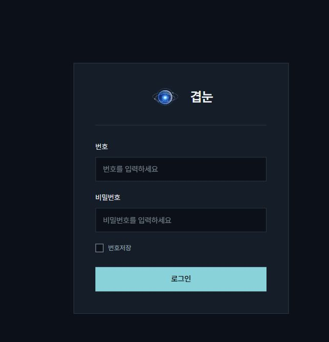
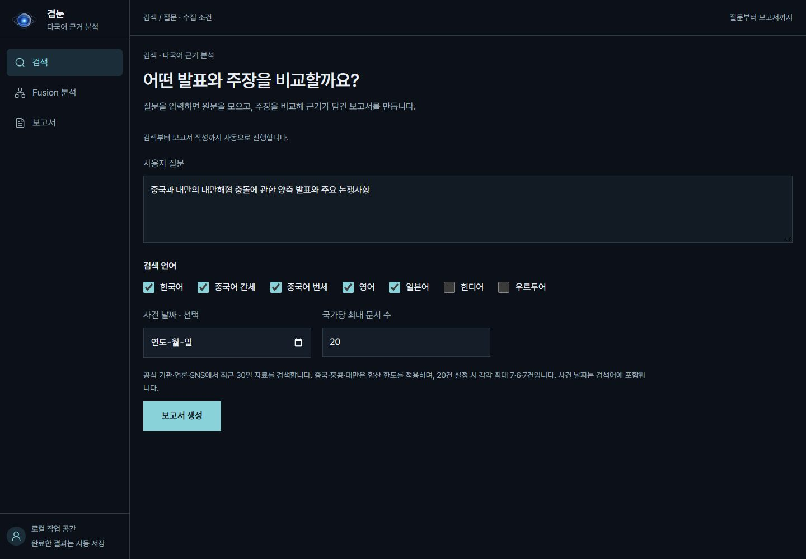
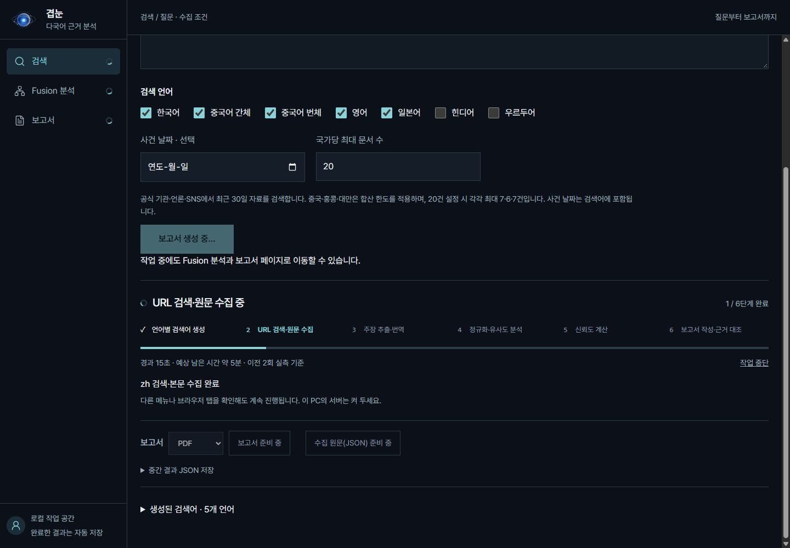
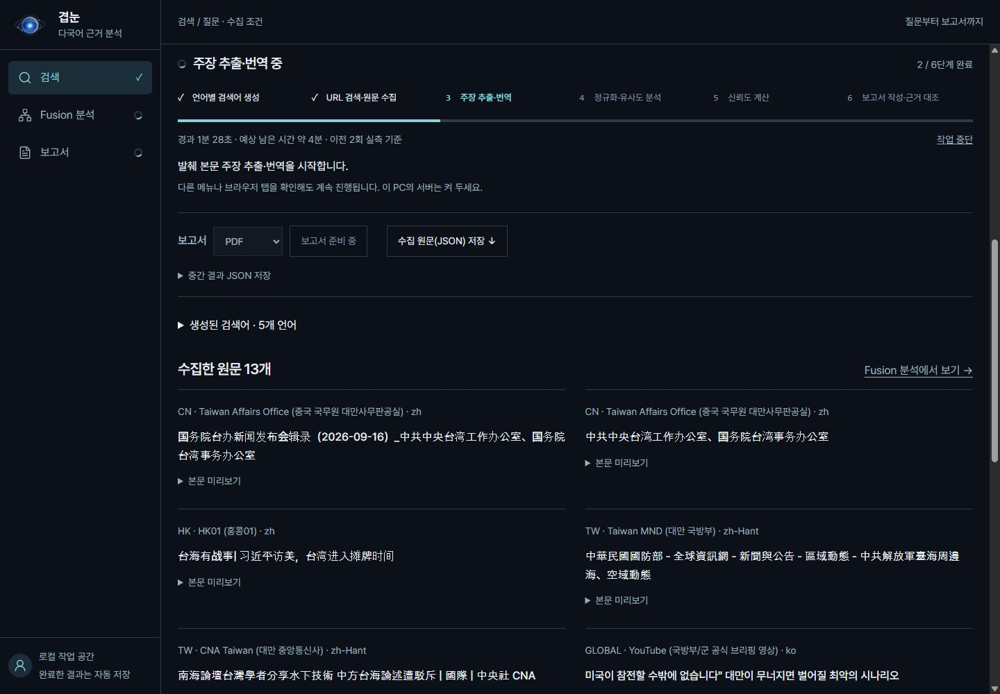
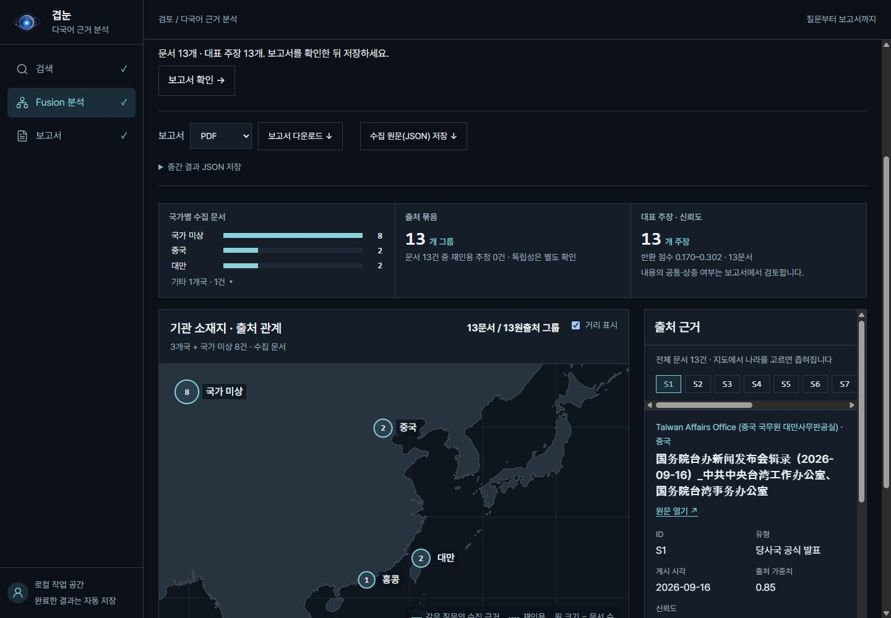
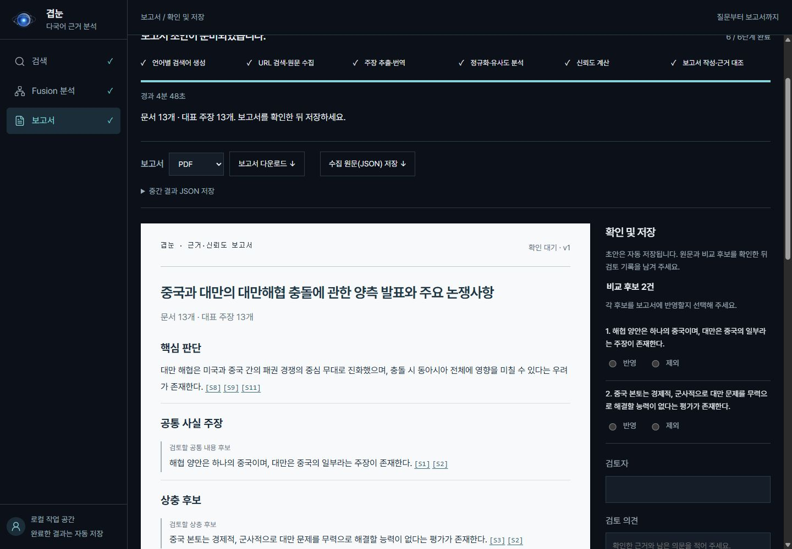
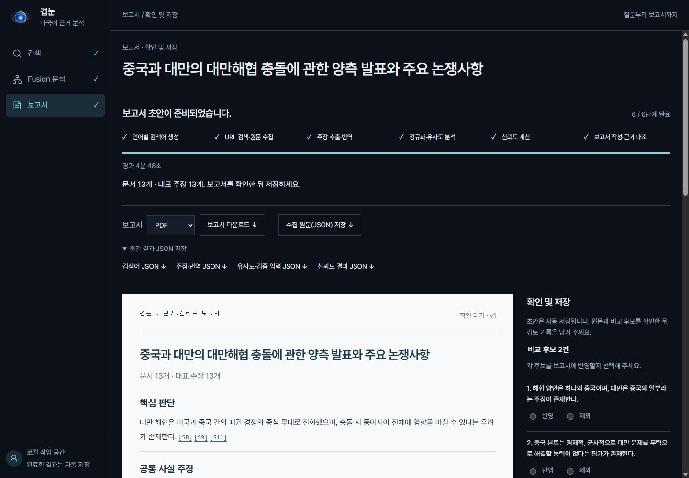
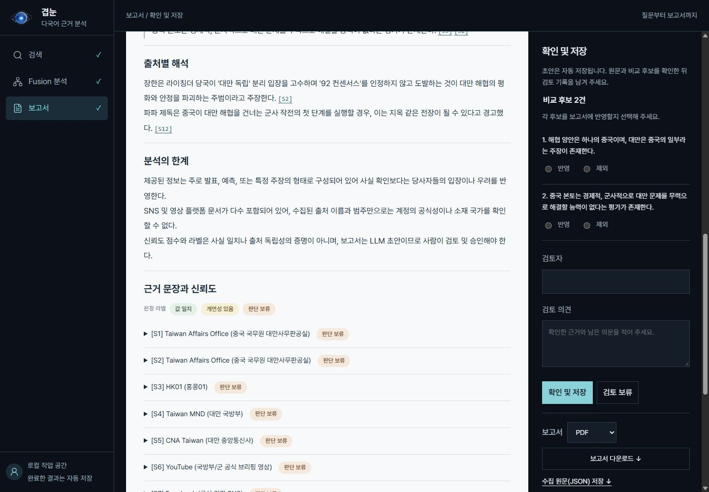

# 겹눈 원스톱 과정 갤러리

[프로젝트 소개로 돌아가기](../../README.md#화면-샘플)

로그인부터 질문, 수집, Fusion 분석, 보고서, 다운로드, 검토·저장까지 화면을 순서대로 모았습니다. 이미지를 누르면 원본 크기로 볼 수 있습니다.

2026-10-11 보존 캡처 기준입니다. 로그인은 별도 촬영한 화면이고, 질문 이후 과정은 `one-stop-20261011-v2` 실행 캡처입니다. 하나의 연속 촬영이나 동영상은 아닙니다. PC·모바일 표시는 브라우저 화면 폭 기준이며 휴대폰 실기기 촬영은 아닙니다. 캡처의 문서 수·점수·시간은 해당 실행의 예시입니다.

[1. 로그인](#1-로그인) · [2. 질문](#2-질문과-수집-조건) · [3. 검색·수집](#3-검색수집과-원문-확인) · [4. Fusion](#4-fusion-분석) · [5. 보고서](#5-근거-보고서) · [6. 다운로드](#6-결과-다운로드) · [7. 검토·저장](#7-검토와-저장)

## 1. 로그인

번호와 비밀번호를 입력하는 진입 화면입니다. 이 화면 자체는 계정 인증을 수행하지 않습니다. Azure의 팀 공유 HTTP 기본 인증은 별도로 적용됩니다.

[모바일 로그인 원본](login-20261011/mobile.jpg)

## 2. 질문과 수집 조건

질문, 검색 언어, 선택적 사건 날짜와 국가별 문서 상한을 지정하고 보고서 생성을 시작합니다.

[모바일 질문 화면](one-stop-20261011-v2/mobile/01-question.jpg)

## 3. 검색·수집과 원문 확인

검색어 생성과 원문 수집이 진행됩니다. 작업 중 Fusion 분석이나 보고서 메뉴로 이동해도 서버가 켜져 있으면 계속 실행됩니다.

검색·수집 진행 화면 보기

[모바일 수집 진행](one-stop-20261011-v2/mobile/02-search-collecting.jpg)

수집한 원문 목록 보기

[모바일 원문 목록](one-stop-20261011-v2/mobile/05-collected-originals.jpg)

| 진행 중 다른 메뉴를 열었을 때 | PC | 모바일 |
| --- | --- | --- |
| Fusion 분석 대기 | [화면 보기](one-stop-20261011-v2/pc/03-fusion-waiting.jpg) | [화면 보기](one-stop-20261011-v2/mobile/03-fusion-waiting.jpg) |
| 보고서 대기 | [화면 보기](one-stop-20261011-v2/pc/04-report-waiting.jpg) | [화면 보기](one-stop-20261011-v2/mobile/04-report-waiting.jpg) |

## 4. Fusion 분석

국가별 문서 분포, 기관 소재지·출처 관계, 원문·번역과 신뢰도 정보를 함께 확인합니다. 지도는 출처의 소재 지역을 보여주며 실제 사건 위치나 이동 경로를 추적하지 않습니다.

[모바일 Fusion 화면](one-stop-20261011-v2/mobile/06-fusion-result.jpg) · [모바일 주장·원문 근거 상세](one-stop-20261011-v2/mobile/06b-claims-evidence.jpg)

## 5. 근거 보고서

근거가 연결된 보고서 초안을 읽고 출처 인용과 비교 후보를 검토합니다. 자동 작성된 판단이나 점수 라벨은 사실 확정이 아닙니다.

[모바일 보고서](one-stop-20261011-v2/mobile/07-report.jpg) · [PC 라벨 상세](one-stop-20261011-v2/pc/07b-labels.jpg) · [모바일 라벨 상세](one-stop-20261011-v2/mobile/07b-labels.jpg)

## 6. 결과 다운로드

보고서는 PDF·Markdown·JSON으로 내려받고, 수집 원문과 중간 결과 JSON은 별도로 저장합니다.

다운로드 화면 보기

[모바일 다운로드 화면](one-stop-20261011-v2/mobile/08-downloads.jpg)

## 7. 검토와 저장

비교 후보의 반영·제외를 선택하고 검토자와 의견을 남기는 화면입니다. 캡처 과정에서는 실제 승인을 수행하지 않았습니다. 승인은 보고서 검토 기록이지 내용의 진위 보증이 아닙니다.

검토·저장 화면 보기

[모바일 검토·저장 화면](one-stop-20261011-v2/mobile/09-review-save.jpg)

## 원본과 실행 기록

- [PC 캡처 폴더](one-stop-20261011-v2/pc) · [모바일 캡처 폴더](one-stop-20261011-v2/mobile)
- [실행 ID·캡처 시각·화면 크기 기록](one-stop-20261011-v2/capture-manifest.json)
- [기존 HTML 갤러리](one-stop-20261011-v2/index.html) — 질문 이후 PC·모바일 화면을 나란히 보는 파일입니다. 로컬 브라우저에서 열 수 있으며 GitHub에서는 HTML 소스가 표시됩니다.

[프로젝트 소개로 돌아가기](../../README.md#화면-샘플)
