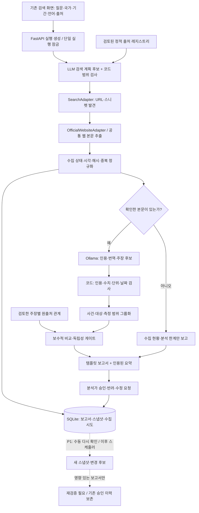

# Fusion OSINT Copilot — 수집 파이프라인 설계 검토안

최신성 체크: 2026-10-10 코드·설정·로컬 테스트·공식 문서 확인 기준.

상태: **설계 검토용. 이 문서의 신규 모듈·DB·API는 아직 구현하지 않았다.** 기존 앱 코드는 변경하지 않았다. 문서의 시간·예산·동시성 수치는 구현 제안이며 성능 보장이 아니다.

## 1. 먼저 결정할 내용

1. Python/FastAPI/Pydantic/SQLite와 기존 화면을 유지한다. TypeScript 서버, Redis, Celery, 별도 벡터 DB는 추가하지 않는다.
2. P0 수집기는 `SearchAdapter`와 `OfficialWebsiteAdapter` 두 개다. YouTube는 P1, X/Facebook/Weibo는 P2다. 미연동 출처는 실패한 척하지 않고 `미연동·미시도`로 표시한다.
3. 생성 모델은 설치된 Ollama `qwen3:4b`를 우선 후보로 연결한다. 출처의 공식성·독립성·최종 검증 상태는 LLM이 결정하지 않는다.
4. 기존 `reports` JSON 저장을 유지하고, 원문 스냅샷과 수집 시도 테이블만 추가한다. 주장·근거·판단·검토 이력은 보고서 JSON 안에서 명시적으로 연결한다.
5. 주력 시연은 대만해협 한 사건이다. 중국–필리핀, 태국–캄보디아는 같은 파이프라인의 추가 프리셋이며, 세 사례 모두의 실시간 수집을 P0 완료 조건으로 삼지 않는다.
6. 자동 모니터링·재검증은 P1이다. P0에서도 게시 시각·사건 시각·최초 수집·마지막 확인을 구분하고 수집 실패를 보고서에 남긴다.

**검토 순서:** 범위 확정 → 앱용 Tavily 연결 경로 확인 → W0~W6 구현. 아직 출처별 완전 수집, 다국어 추출 정확도, 국방 RAG가 완성됐다고 주장할 수 없다.

## 2. 현재 코드베이스 확인 결과

### 2.1 기술 스택과 검증 수준

| 항목 | 현재 확인한 내용 | 수준 |
|---|---|---|
| 서버 | Python 3.12 이상, FastAPI, Uvicorn | ✅ `pyproject.toml` 확인 |
| 자료형 | Pydantic, 추가 필드 제한·구조화 출력 | ✅ `schemas.py`, `providers.py` 확인 |
| 외부 검색 | `AsyncTavilyClient.search/extract` | ✅ 코드 존재 / ⚠️ 앱을 통한 실제 호출은 미검증 |
| LLM | `AsyncOpenAI.responses.parse` | ✅ 코드 존재 / 로컬 Ollama 연결은 미구현 |
| DB | SQLite `reports(id, body)`; 보고서 전체 JSON 저장 | ✅ `storage.py` 확인 |
| 화면 | HTML/CSS/순수 JavaScript, API 조회·보고서·검토 | ✅ 코드 확인 |
| 스토리보드 | `docs/storyboard.*`의 별도 정적 시안 | ✅ 존재 / 실제 앱 기능과 구분 필요 |
| 기존 테스트 | Python 56개 통과, 프런트엔드 4개 통과 | ✅ 2026-10-10 재실행 |
| 테스트 경고 | FastAPI TestClient의 httpx 사용 중단 예정 경고 1건 | ⚠️ 기존 의존성 호환 경고; 이번 설계에서 버전 교체하지 않음 |

테스트 수는 실행 결과 그대로 기록했다. 테스트는 MockTransport/FakeProvider와 로컬 데모를 포함하며, 실제 외부 수집 성공을 보증하지 않는다. 첫 제한 환경 테스트 실행이 응답하지 않아 이번 턴이 시작한 프로세스만 종료했고, 사용자 계정 권한에서 제한 시간 재실행으로 통과를 확인했다.

### 2.2 재사용할 모듈

| 파일 | 재사용할 기능 | 보완할 기능 |
|---|---|---|
| `app/main.py` | 실행 생성·조회, 한 번에 한 실행, 버전 충돌 방지, 검토·내보내기 API | 입력 범위, 수집 현황, 반려·수정 요청, 제공자별 준비 상태 |
| `app/pipeline.py` | 명시적 단계 진행, 저장, 부분 검색·추출 실패 경고 | 출처별 수집 결과/시도 저장, 본문 확보 여부에 따른 추출 게이트 |
| `app/providers.py` | HTTPS/도메인 검사, URL 발견, Tavily 검색·본문 추출 | 출처 레지스트리 적용, 검색과 본문 수집 분리, LLM 클라이언트 결합 해소 |
| `app/verification.py` | 인용문 존재, 수치·단위·시간대 검사, 보수적 비교 | 주장별 원출처 계보, 독립성 미확인 처리, 교차확인 승격 조건 |
| `app/storage.py` | SQLite 연결 수명, 트랜잭션, JSON 보고서·검토 버전 저장 | 스냅샷·수집 시도 저장 |
| `app/export.py` | 원문·판단·한계·감사 이력의 템플릿 보고서 | 수집 현황, 사건/게시/확인 시각, 관점 차이·재검증 상태 |
| `app/static/*` | 실제 앱 UI, 비동기 조회 경합 방지 | 국가·기간·출처 선택, 상태와 원출처 관계 표시 |
| `tests/*` | 기존 안전성·회귀 테스트 | 신규 수집 상태, 원출처 계보, 로컬 모델 계약, 승인 조건 테스트 |

현재 부족한 기능: 기관/공식 계정 레지스트리, 실패 자료의 공통 데이터 구조, 원문 스냅샷 공유, 주장별 원출처 관계, Ollama 연결, 국가·기간·간체/번체 선택의 실제 API 반영, 신규 정보 감지, 저장 자료의 검색 인덱스.

현재 `publisher_group`은 도메인 그룹이다. 서로 다른 도메인을 독립 근거로 보장하지 않으며, 현재 값 일치 판정도 사실 확정을 뜻하지 않는다. 이 한계는 새 구현에서도 숨기지 않는다.

## 3. 외부 연결·권한 확인표

| 서비스/출처 | 확인된 상태 | 아직 확인할 것 | 설계상 처리 |
|---|---|---|---|
| Tavily CLI | 설치·OAuth 인증·실제 검색 성공 | 앱 SDK 인증은 별도 | CLI를 제품 런타임으로 호출하지 않음 |
| Tavily 앱 SDK | 기존 연동 코드 존재 | `TAVILY_API_KEY`는 현재 프로세스/사용자 설정에 미설정 | W0 연결 검증 전까지 앱 실시간 수집 가능 표시 금지 |
| Tavily 대만 국방부 원문 | CLI 추출 성공, 실제 본문 확보 확인 | 선정 사건과 같은 기간의 다른 자료 확보 | 검증용 샘플이지 완성된 교차검증 사례가 아님 |
| 중국 국방부 샘플 URL | CLI basic에서 `Failed to fetch url` | 허용된 재시도 또는 다른 공개 공식 자료 | `ERROR`; 로그인/CAPTCHA 차단이라고 추정하지 않음 |
| Ollama | 로컬 API 응답, `qwen3:4b` 설치, D드라이브 저장, GPU 실행 확인 | 앱 연결·다국어 자료 회귀 평가 | 로컬 제공자 연결 후 별도 검증 |
| OpenAI | 키 설정 여부만 확인됨 | 실제 호출·비용·품질 비교는 이번 설계에서 미실행 | 선택 대안; 동의 없이 자동 유료 전환 금지 |
| YouTube | API 키가 현재 프로세스/사용자 설정에 없음 | 프로젝트/API 활성화, 공식 채널 ID, 할당량 | P1. 영상 메타데이터만 기본 범위 |
| X | 확인한 `X_BEARER_TOKEN` 설정 없음 | 계정·앱·API 권한과 실제 호출 | P2, 미연동 |
| Facebook/Weibo | 앱 설정·권한을 검증하지 않음 | 공식 API 및 계정 접근 권한 | P2, 미연동 |

설정 여부는 지정한 환경 변수와 프로젝트 `.env` 존재 여부만 검사했다. 다른 비밀 저장소에 자격증명이 없다고 단정하지 않는다. 키 값은 출력하거나 문서에 저장하지 않는다.

Tavily SDK는 API 키를 받는 클라이언트다. CLI의 OAuth 토큰을 SDK 키로 취급하지 않는다. 공식 keyless REST를 대안으로 검토할 수 있지만, 현재 앱에서 검증하지 않았으므로 P0에 여러 인증 경로를 동시에 추가하지 않는다. **W0에서 앱 SDK 키 또는 실제 검증된 공식 REST 경로 하나를 선택한다.** 연결이 안 되면 실시간 P0는 미완료로 표시하고, 명시적인 공개 원문 스냅샷 재생만 시연한다.

YouTube 공개 영상이 있다는 사실만으로 공식 자막 다운로드 권한이 생기지 않는다. 공식 `captions.download`는 영상 편집 권한을 요구한다. 따라서 제3자 공식 영상의 자막·발언을 자동으로 확보 가능하다고 가정하지 않는다.

## 4. 24시간 MVP 범위

### P0 — 한 사건에서 끝까지 작동

- 질문, 국가 쌍, 기간, 언어, 출처 유형 선택을 실제 요청에 반영.
- 검토한 정적 공식 출처 레지스트리. LLM 생성 URL/계정을 등록하지 않음.
- `SearchAdapter`: 허용 출처에서 URL·제목·검색 스니펫 발견.
- `OfficialWebsiteAdapter`: 발견/선정한 공식 URL에서 본문 추출.
- 언론 URL도 같은 본문 추출 경로를 재사용하되 출처 유형을 언론으로 유지.
- 수집 시도·미확인 사유·원문 확보 범위를 저장하고 기존 분석 화면 안에 표시.
- URL/플랫폼 ID/본문 해시 기준의 확정적 중복 식별.
- 원문 스냅샷 저장, 문단 ID와 인용 구간 연결.
- Ollama 기반 검색어·주장·번역 후보 생성과 코드의 형식/원문 대조.
- 동일 사건·대상·측정 항목·기간에서 비교 가능한 주장만 그룹화.
- 원출처 중복·독립성 미확인·주장 일치·상충·판단 보류를 분리.
- 인용된 템플릿 보고서, 승인·반려·수정 요청 및 변경 이력.
- `live`, 기존 가상 `demo`, 실제 스냅샷 `replay`를 명확히 구분.

전용 수집 대시보드는 P1이지만, 출처별 상태/실패 사유 표는 P0에 포함한다. 11개 사용자 단계를 11개 화면으로 만들지 않고, 기존 **검색 → 분석 → 보고서·검토** 화면에 통합한다.

### P1 — 여유가 생겼을 때만

- 공식 YouTube 채널의 제목·설명·게시 시각·영상 URL 수집.
- 선정된 기존 URL의 수동 다시 확인 → 변경 후보 표시 → 재검증 필요 전환.
- 스케줄러와 신규 게시물 발견은 위 수동 흐름 검증 이후.
- 저장 원문에 대한 키워드/다국어 검색 개선. 임베딩은 검색 품질이 필요할 때 추가.

### P2 — 이번 해커톤에서 제외

- X/Facebook/Weibo API, 로그인/CAPTCHA 우회, 쿠키 재사용.
- 영상·이미지 진위 판별, OCR/음성 인식, 실시간 AIS/레이더/비행 경로 분석.
- 별도 벡터 DB 서버, 대형 국방 지식베이스, 파인튜닝, 관리자 UI, 다중 사용자 권한 체계.
- 세 시나리오의 모든 출처에 대한 상시 실시간 모니터링.

## 5. 시스템 아키텍처와 책임 경계



| 결정 | 담당 | 제한 |
|---|---|---|
| 검색어·의미/번역·주장 종류 후보 | LLM | 사용자 범위를 벗어나면 거절/보류; 정답 판정 아님 |
| URL/기관/계정 공식성 | 레지스트리와 코드 | 등록된 신원·증거 범위만 인정 |
| 수집 성공·실패 | 수집기와 코드 | 실제 확보 범위와 확인된 오류만 기록 |
| 주장별 원출처 계보 | 명시적 관계·검토자 | LLM 후보는 검토 전 `UNKNOWN` |
| 수치·시간·인용·비교 가능성 | 코드 | 의미/관측 범위가 모호하면 비교 보류 |
| 독립 근거 교차확인·승인 | 코드 게이트 + 검토자 | 출처 수나 공식성만으로 승격하지 않음 |

## 6. 모듈·폴더 구조 제안

기존 파일은 유지하며 작은 모듈만 추가한다. 아래 트리는 **구현 예정 구조**다.

```text
d4d/
├─ app/
│  ├─ main.py             기존 API·실행 잠금·검토
│  ├─ config.py           기존 설정 + 제공자별 준비 상태
│  ├─ schemas.py          기존 자료형 + 수집·원출처·검토 자료형
│  ├─ registry.py         신규: 정적 기관/계정 목록과 URL 매칭
│  ├─ collectors.py       신규: 공통 계약·검색/웹 수집기 두 개
│  ├─ providers.py        기존: Tavily 클라이언트·URL 검사·연결
│  ├─ llm.py              신규: Ollama 제공자, 기존 OpenAI 선택 경로
│  ├─ provenance.py       신규: 주장별 원출처·재인용·독립성 게이트
│  ├─ pipeline.py         기존: 단계·부분 실패·진행 상태
│  ├─ verification.py     기존: 인용/수치/시간 검사·보수적 비교
│  ├─ storage.py          기존: JSON 보고서 + 스냅샷/시도 테이블
│  ├─ export.py           기존: 근거·한계·시각·검토 템플릿
│  ├─ demo.py             기존 가상 자료; 실제 자료와 혼합 금지
│  └─ static/             기존 실제 앱 화면
├─ config/
│  ├─ sources.json        신규 예정: 검토한 출처·공식 계정
│  └─ scenarios.json      신규 예정: 사건 범위·별칭·검토한 계보
├─ data/                  기존 gitignored SQLite·실제 스냅샷 저장
├─ tests/                 기존 회귀 테스트 + 신규 모듈 테스트
└─ docs/                  기존 시안·다이어그램·이번 설계안
```

Python `Protocol` 수준의 계약만 사용한다. 각 SNS의 빈 구현 클래스, 범용 플러그인 시스템, 추상 저장소 계층은 미리 만들지 않는다.

## 7. 공식 출처 레지스트리

초기에는 JSON + Pydantic 검증이다. 기존 도메인 목록은 수집 보안 검사에 재사용하되, 공식성 정보는 별도 레코드로 관리한다.

| 필드 | 의미 |
|---|---|
| `id`, `country`, `organization`, `organization_type` | 기관/채널 식별. 국가 미확인은 null |
| `source_type` | defense / military / coast_guard / foreign_affairs / press / official_sns |
| `website_url`, `allowed_hosts`, `allowed_path_prefixes` | 검토한 수집 범위; 부적절한 전체 플랫폼 허용 금지 |
| `platform`, `account_id`, `account_url` | 공식 SNS 확인 후에만 입력; 웹 기관은 null 가능 |
| `identity_status` | NEEDS_REVIEW / VERIFIED / REJECTED |
| `identity_evidence_url`, `identity_evidence_note` | 기관 홈페이지의 계정 링크 등 공식성 확인 근거 |
| `verified_by`, `last_verified_at` | 실제 확인한 검토자·시각. 모르면 null |
| `collection_method`, `enabled` | tavily_extract / search_discovery / youtube_api 등, 활성화 여부 |
| `language_hints`, `revision` | 언어 힌트와 설정 버전. 본문 언어/사실 판정 아님 |

활성 공식 출처는 확인 근거와 검토 기록이 있어야 한다. 공식 SNS는 플랫폼 도메인만으로 등록하지 않고 정확한 계정/채널을 확인한다. 기관 페이지가 handle만 제공하면 채널 ID와의 대응도 별도로 확인한다. 페이지 링크·계정 변경 가능성이 있으므로 신원 확인 시각을 보존한다.

`country`는 발행 기관의 소속이고, 사건의 관련 국가는 분석 요청/주장의 별도 필드다. 해외 언론사가 APAC 사건을 보도한다고 발행국을 사건 국가로 바꾸지 않는다.

설정이 바뀌어도 이전 보고서의 출처 판정이 조용히 변하지 않도록, 실행마다 `registry_revision`과 사용한 기관/계정 정보를 저장한다.

## 8. SourceAdapter와 수집 데이터 계약

### 8.1 공통 인터페이스

```python
class SourceAdapter(Protocol):
    source_type: str

    async def collect(self, request: CollectionRequest) -> CollectionResult:
        """확보한 자료와 수집 시도를 반환한다. 출처의 진위를 판정하지 않는다."""
```

인터페이스는 설계 예시이며 현재 코드가 아니다.

`CollectionRequest`: run_id, registry_source_ids, query, language, date_range, urls, 적용된 요청 예산.

`CollectionResult`: items, attempts. 검색 수집기의 items는 스니펫/메타데이터이고, 웹 수집기의 items는 실제 확보한 본문 또는 실패 상태다. 둘을 동일 자료형으로 반환하되 `content_scope`와 `fetch_status`로 구분한다.

### 8.2 공통 자료형

| 필드 | 규칙 |
|---|---|
| `source_id`, `registry_source_id`, `document_id`, `snapshot_id` | 보고서 안의 출처, 기관 레코드, 문서, 버전 식별자를 구분 |
| `source_type`, `platform`, `country`, `organization`, `author` | 코드/확인한 메타데이터로 설정. 모르면 null |
| `title`, `original_url`, `platform_post_id` | 발견과 본문 수집 모두에서 저장 가능 |
| `original_text`, `search_snippet` | 별도 필드. 스니펫을 원문으로 복사하지 않음 |
| `language` | 확인 결과 또는 unknown. 검색어 언어를 본문 언어로 단정하지 않음 |
| `published_at`, `collected_at`, `last_checked_at` | 각각 게시 시각, 최초 확보, 마지막 확인. 미확인 게시일은 null |
| `fetch_status`, `content_scope`, `collection_method` | 상태·확보 범위·방법. 잘린 본문은 표시 |
| `content_hash`, `truncated`, `data_kind` | 실제 확보 텍스트의 해시, 잘림, real/mock 구분 |

`event_at`은 문서의 게시 시각과 다르므로 주장에 저장한다. 원문에 없는 사건 날짜를 게시일·수집일로 자동 대체하지 않는다. “오늘”은 확인된 원문의 게시 맥락과 시간대가 있어야 절대 날짜로 정규화한다.

`content_hash`는 수집한 텍스트의 동일성 검사다. 사이트 전체 HTML 원본, 출처 진위 또는 사건의 사실성을 보증하는 서명이 아니다.

### 8.3 수집 상태

| 상태 | 설정하는 조건 | 주장 추출/검증 사용 |
|---|---|---|
| FETCHED | 기사/성명 본문을 실제 확보하고 본문 검사 통과 | 인용 구간 검사 후 가능 |
| PARTIAL | URL·검색 스니펫·메타데이터만 확보, 또는 본문이 불완전 | P0에서는 사실 교차검증 근거로 제외 |
| AUTH_REQUIRED | 인증이 필요하다는 확인된 응답/수집 계약 | 제외 |
| BLOCKED | 접근 거부가 확인된 응답 | 제외 |
| NOT_FOUND | 확인된 404/삭제 등 | 제외 |
| ERROR | 타임아웃, 기타 오류, 원인 불명 fetch 실패 | 제외 |

API 키 미설정·수집기 미구현·비활성 출처는 `attempt.outcome=NOT_ATTEMPTED`, `error_code=PROVIDER_UNCONFIGURED/ADAPTER_DISABLED`로 표시한다. 호출하지 않은 SNS를 BLOCKED/NOT_FOUND로 표시하지 않는다.

Tavily의 HTTP 요청이 성공해도 `failed_results`를 반드시 검사한다. `raw_content`가 있더라도 로그인/오류 화면·메뉴만 있으면 FETCHED로 처리하지 않는다. 본문 완전성을 확인할 수 없으면 PARTIAL과 확인 사유를 남긴다.

## 9. DB 스키마: 기존 JSON + 테이블 두 개

### 9.1 물리 저장

| 저장 위치 | 역할 |
|---|---|
| 기존 `reports(id, body)` | 질문·계획·상태·출처 참조·주장·판단·근거·검토 이력 |
| 신규 `document_snapshots` | 실제 확보 원문과 메타데이터의 버전별 보관 |
| 신규 `collection_attempts` | 성공/실패/미시도·마지막 확인·오류·소요 시간 |
| 정적 `config/sources.json` | 기관/공식 계정 레지스트리 |

따라서 P0에서 claims/findings/evidence를 각각 별도 SQL 테이블로 분리하지 않는다. 논리 스키마는 아래에서 명시하고 보고서 JSON에 저장한다. 기존 자료를 파괴적으로 재구성하지 않는다.

```sql
-- 설계 예시. 아직 실행하거나 DB를 변경하지 않았다.
CREATE TABLE document_snapshots (
    id TEXT PRIMARY KEY,
    document_id TEXT NOT NULL,
    registry_source_id TEXT,
    original_url TEXT NOT NULL,
    platform_post_id TEXT,
    title TEXT NOT NULL,
    language TEXT NOT NULL,
    original_text TEXT NOT NULL,
    content_hash TEXT NOT NULL,
    published_at TEXT,
    collected_at TEXT NOT NULL,
    content_scope TEXT NOT NULL,
    truncated INTEGER NOT NULL DEFAULT 0,
    data_kind TEXT NOT NULL CHECK (data_kind IN ('real', 'mock')),
    metadata_json TEXT NOT NULL,
    UNIQUE (document_id, content_hash, data_kind)
);

CREATE TABLE collection_attempts (
    id TEXT PRIMARY KEY,
    run_id TEXT NOT NULL REFERENCES reports(id),
    registry_source_id TEXT,
    adapter TEXT NOT NULL,
    operation TEXT NOT NULL,
    target TEXT NOT NULL,
    attempt_number INTEGER NOT NULL,
    outcome TEXT NOT NULL,
    fetch_status TEXT,
    started_at TEXT NOT NULL,
    finished_at TEXT,
    snapshot_id TEXT REFERENCES document_snapshots(id),
    error_code TEXT,
    error_detail TEXT,
    response_ms INTEGER,
    provider_request_id TEXT,
    metadata_json TEXT NOT NULL
);

CREATE INDEX idx_snapshots_document ON document_snapshots(document_id);
CREATE INDEX idx_attempts_run ON collection_attempts(run_id);
CREATE INDEX idx_attempts_source ON collection_attempts(registry_source_id, finished_at);
```

상태 필드는 Pydantic으로 허용값을 검사하고, 구현 시 같은 열거값을 SQL CHECK 제약에도 적용한다. 레지스트리 ID는 정적 JSON을 참조하므로 존재 여부는 애플리케이션에서 검사한다.

### 9.2 보고서 JSON의 논리 스키마

| 구성 | 핵심 필드 |
|---|---|
| AnalysisScope | countries, start_at/end_at, languages, source_types, scenario_id, mode |
| SearchPlan | 사건·검색어·비교 항목; 허용 범위와 대조한 계획 |
| SourceRef | source_id, registry_source_id, snapshot_id, 발견 메타데이터, 마지막 수집 상태 |
| Paragraph | paragraph_id, snapshot_id, 원문 구간/텍스트 |
| Claim | id, target_id, source_id, snapshot_id, paragraph_id, quote/span, 번역, 주장 주체·종류, event_at, 수치/단위, 표현 상태, 정규화 결과 |
| OriginLink | claim_id, origin_group_id, relation, evidence_basis, reviewed_by/at, status |
| Finding/ClaimGroup | event/target/scope, claim_ids, assertion_relation, verification_status, 근거·보류 사유 |
| EvidenceRef | claim_id + snapshot_id + paragraph_id + 인용 구간. 원문 없는 URL은 사실 근거로 인정하지 않음 |
| AuditEntry | 기존 version·행위·의견·검토자 입력·시각 + 변경 대상 |

각 ClaimGroup은 같은 사건 ID, 관측 기간, 대상, 측정 항목과 집계 범위를 확인해야 한다. 예: 항공기 대수와 출격 횟수는 서로 다른 측정 항목이다.

이전 JSON은 `schema_version=1`로 읽어 호환 변환한다. 새 버전의 origin/independence는 UNKNOWN으로 초기화하며 과거 도메인 수를 독립성 확인으로 이관하지 않는다. 승인 이력과 과거 스냅샷을 덮어쓰지 않는다.

## 10. 원문 중복과 독립성 통제

### 10.1 확정적 중복만 자동 처리

- URL fragment와 확인된 추적 파라미터만 정리한다. 문서/언어/게시물 식별용 query는 임의로 삭제하지 않는다.
- 동일 canonical URL + 같은 본문 해시이면 기존 스냅샷을 재사용하고 확인 시도만 추가한다.
- 동일 플랫폼 게시물 ID이면 같은 문서로 연결한다.
- 같은 본문 해시는 동일 텍스트로 표시하되 발행 경로·출처 참조를 지우지 않는다.
- 번역·재인용·보도자료 계보는 URL/해시만으로 확정할 수 없다. 명시적인 인용 관계나 검토 기록이 필요하다.

### 10.2 주장별 원출처

국방부 발표 A → 발표 A를 인용한 언론 → 발표 A의 공식 SNS 번역은 한 근거 계보다. 기사 안에 기자의 별도 관측이 있으면 해당 주장만 다른 계보 후보로 분리한다.

`origin_group_id`가 다르다는 사실만으로 독립성을 확정하지 않는다. 같은 주장에 대한 별도의 관측·기록 등 확인 근거와 검토 기록이 필요하다. 서로 다른 정부라는 사실도 충분조건이 아니다.

P0는 시연 자료의 관계를 팀이 수동으로 검토한 프리셋과 분석가 검토를 사용한다. LLM이 제안한 관계는 UNKNOWN에서 시작한다. 확인 근거가 없으면 독립성 미확인으로 보존한다.

### 10.3 LLM과 분리하는 상태

LLM 출력에서 `official`, `independent`, `verified`, `confidence` 등 신원/최종 검증 판정 필드를 제거한다. 허용되지 않은 추가 필드는 형식 검사에서 거절한다. 출처 ID·URL·기관·원출처 관계는 코드가 부여한다.

LLM은 quote, translation, 주장 주체 후보, factual_claim/opinion/estimate, 수치·시간·부정/추정 표현만 제안한다. `factual_claim`은 사실이라는 주장이며 검증된 사실이라는 뜻이 아니다.

로컬 모델 한 문단 시험에서 숫자는 맞았지만 공식 발표를 독립 검증으로 잘못 분류한 사례가 관찰됐다. 따라서 프롬프트만 강화하는 것이 아니라 판정 권한 자체를 제거한다. 이 시험은 모델의 전체 정확도 평가가 아니다.

## 11. 주장 그룹화와 교차검증

### 11.1 원문 대조 게이트

1. FETCHED·real 본문과 유효한 스냅샷/문단 ID를 가진 자료만 실데이터 추출 대상으로 삼는다.
2. LLM의 quote가 해당 문단에 실제 존재하는지 검사한다.
3. 숫자·부정·단위·날짜가 인용과 일치하는지 검사한다. 기존 보수적 검사를 재사용한다.
4. 확인되지 않은 연도/시간대/단위는 생성하지 않고 보류한다.
5. 오류가 있는 주장은 제외 사유를 보존한다. 번역 의미·서술형 추론은 자동 원문 일치 검사로 정확성이 보증되지 않는다.

### 11.2 두 축을 따로 저장

`assertion_relation`: ALIGNED / CONFLICTING / PERSPECTIVE_DIFFERENCE / NOT_COMPARABLE.

`verification_status`: CORROBORATED / CONFLICTING / INSUFFICIENT / UNVERIFIED.

| 상황 | 처리 |
|---|---|
| 같은 조건의 정규화 값 일치, 원출처 중복/독립성 미확인 | ALIGNED + UNVERIFIED |
| 같은 조건의 값 일치, 해당 주장에 대한 서로 독립된 근거가 검토됨 | CORROBORATED 후보. 근거와 검토 기록 필수 |
| 같은 조건의 정확값 상충 | CONFLICTING. 어느 쪽이 진실인지는 미결정 |
| 훈련 목적·평가·프레이밍이 다름 | PERSPECTIVE_DIFFERENCE. 단순 표현 차이를 모순 처리하지 않음 |
| 사건/기간/지역/측정 범위가 다름 | NOT_COMPARABLE + UNVERIFIED |
| 비교할 원문 근거 부족 | INSUFFICIENT. 기사 미발견은 반박 근거가 아님 |
| 수정·대체 발표가 있음 | 기존 revision_review 보존; 계보를 확인하기 전 비교 보류 |

서술형 의미 일치와 관점 차이는 LLM 후보 + 원문 비교 + 사람 검토로 다룬다. P0에서 임의 질문의 모든 다국어 주장을 완벽하게 자동 판정한다고 표시하지 않는다. 주력 사건의 제한된 비교 항목부터 검증한다.

CORROBORATED도 사실 확정 확률이나 절대 진실을 뜻하지 않는다. 보고서에는 교차확인에 사용한 근거·조건·독립성 확인 범위를 명시한다. 신뢰도 퍼센트는 만들지 않는다.

## 12. API 설계

기존 `/api/runs` 경로를 유지한다. 화면마다 별도 실행 API를 만들지 않는다.

| 경로 | 변경/신규 | 역할 |
|---|---|---|
| GET `/api/config` | 확장 | 제공자별 configured / verified / unavailable, 지원 언어·출처. 비밀 값 없음 |
| GET `/api/source-registry` | 신규 P0 | 선택 가능한 검토된 기관/계정·활성화 상태. 수정 API는 P2 |
| POST `/api/runs` | 확장, 202 | 질문·국가·기간·언어·출처·scenario_id·mode로 비동기 실행 생성 |
| GET `/api/runs` | 유지 | 최근 실행 목록 |
| GET `/api/runs/{id}` | 확장 | 단계·계획·판단·한계·수집 요약·검토 상태 |
| GET `/api/runs/{id}/sources` | 신규 P0 | 출처별 발견/본문 확보/미시도·오류 사유 |
| GET `/api/runs/{id}/sources/{source_id}` | 신규 P0 | 고정된 원문 스냅샷·문단·인용·원출처 연결 |
| PATCH `/api/runs/{id}/findings/{finding_id}` | 확장 | 검토 의견·분석가 보정. 원문/계보를 LLM 결과로 덮어쓰지 않음 |
| POST `/api/runs/{id}/review` | 확장 | approve / reject / request_revision. 기존 hold/reopen은 호환 처리 |
| GET `/api/runs/{id}/export` | 확장 | 상태·인용·수집 실패·최신성·이력 포함 보고서 |
| POST `/api/runs/{id}/refresh` | 신규 P1 | 기존 URL의 수동 재확인. 자동 승인하지 않음 |

입력 스코프는 Pydantic으로 검사한다. 날짜 역전, 지원하지 않는 언어/출처, 허용되지 않은 기관은 422. 실행 중 추가 시작/낡은 검토 버전은 기존처럼 409. 실시간 제공자 미준비는 503이며 Mock으로 조용히 대체하지 않는다. 보고서 미존재는 404.

초기 언어는 ko/en/zh-Hans/zh-Hant를 주력으로 하고 기존 ja를 유지한다. 기존 zh는 스크립트 미지정 호환 값으로 보존하되 신규 UI에서는 간체/번체를 선택한다. 태국–캄보디아 사례는 영문 공식 자료로 시작하고 th/km는 미검증 언어로 비활성 표시한다.

날짜 필터는 검색 API에 전달한 것과 별개로 확보한 게시/사건 시각을 후검사한다. 시각을 확인할 수 없는 자료는 범위 미확인으로 표시한다. 검색 score는 관련성이지 신뢰도/정확도가 아니다.

## 13. 비동기 수집·오류·예산 정책

아래 제한은 P0의 제안값이다. 실제 SDK/원문 성공률과 로컬 모델 측정에 맞춰 조정한다.

| 항목 | 제안 |
|---|---|
| 실행 | 기존 단일 실행 잠금 + 시작 버튼 비활성. Uvicorn worker 1개 |
| 외부 수집 동시성 | 초기 1, 검증 후 최대 2. 같은 제공자의 호출 예산을 공유 |
| 로컬 LLM 동시성 | 1. 검색과 별도 제한 |
| 원문 예산 | 실행당 최대 6문서, 비교 항목 최대 4개, 문서당 최대 6주장으로 기존 상한 재사용 |
| 검색 | 기본 basic, include_answer=false, auto_parameters=false |
| 본문 수집 | 먼저 basic, 감사용 본문 수집에는 query/chunks로 부분만 받지 않음 |
| 수집 타임아웃 | SDK 호출 30초와 바깥 40초 제한을 초기값으로 검증 |
| Ollama 타임아웃 | 초기 로딩을 고려해 요청 120초 후보; 실제 측정 후 조정 |
| 재시도 | 네트워크 일시 오류에 제한적으로 1회. 실패한 항목만 재시도 |
| 429/요청 제한 | Retry-After가 확인되면 준수. 없으면 현재 실행의 추가 호출 중단·상태 저장; 즉시 반복 금지 |
| 인증/접근 거부/미발견 | 반복 재시도하거나 다른 인증 경로로 우회하지 않음 |
| advanced 재시도 | 단순 일시 오류 재시도와 예산을 공유. 적합한 출처만, 최대 한 번 |
| 모델 응답 오류 | 형식 오류만 짧게 재시도 가능. 임의 판정 필드를 받아들이기 위한 재시도 금지 |

최근 CLI OAuth 경로에서 `--timeout`이 원격 도구 스키마와 호환되지 않는 오류가 있었다. 이는 SDK의 timeout 지원과 다른 계층이므로 그대로 앱 SDK의 결함으로 단정하지 않는다. W0는 실제 사용할 앱 경로에서 별도로 확인한다.

출처별 `asyncio.gather(..., return_exceptions=True)`와 즉시 저장을 사용한다. 하나의 실패가 나머지 성공 자료를 버리지 않는다. 원문/유효 주장이 하나도 없으면 실패/근거 부족을 명시하고 조회 가능한 수집 이력을 남긴다. 실행 실패를 가상 성공으로 바꾸지 않는다.

기존 시작 잠금은 단일 프로세스용이다. 여러 worker에서의 분산 잠금·영속 멱등 키·외부 작업 큐는 P2로 남긴다. 서버 재시작 시 실행 중 작업은 중단 이력과 함께 실패 처리하며 자동으로 재과금/재호출하지 않는다.

**수집 성공률:** FETCHED인 고유 대상 수 ÷ 실제 본문 수집을 시도한 고유 대상 수 × 100. 재시도는 분모를 늘리지 않는다. 검색 URL 발견·비활성/미시도 출처는 본문 성공률 분모에서 제외한다. 분모가 0이면 0%가 아니라 `미측정`이다.

API 사용량은 제공자 응답에서 확인된 값만 저장한다. OpenAI 잔액 4달러의 충분 여부나 Tavily 할당량을 보장하지 않는다. 유료 대안으로 자동 전환하지 않으며, 요청 예산·토큰·확인한 사용량을 표시한다.

## 14. 최신성·신규 정보·재검증

### P0

- 사건 시각, 게시 시각, 최초 수집, 마지막 확인을 분리한다.
- `last_checked_at`은 새 수집 시도로 계산한다. 기존 원문 스냅샷을 수정하지 않는다.
- 고정된 사건 기간과 각 문서의 확인 범위를 표시한다.
- 실제 공개 자료를 저장해서 재생하면 `replay`와 당시 게시/수집 시각을 표시한다.

### P1

1. 기존 선정 URL부터 수동 재확인한다.
2. 같은 문서·같은 해시는 확인 시각만 갱신한다.
3. 해시가 바뀌면 새 스냅샷을 생성하고 `변경 후보`로 표시한다. 해시 변화만으로 새로운 사건/상충을 단정하지 않는다.
4. 기존 보고서가 변경된 문서/주장에 연결돼 있으면 재검증 필요를 표시한다.
5. 새 게시물의 관련성은 사건 범위 후보 판정과 사람 검토로 확인한다.
6. 이전 승인 버전과 인용을 보존한다. 새 버전은 다시 검토해야 한다.

스케줄러는 수동 흐름 이후에 추가한다. 선정 출처·할당량에 맞춰 설정하고, 비활성/권한 미확인 출처는 실행하지 않는다. 정기 폴링을 실시간 감시라고 표현하지 않는다.

## 15. 보고서·승인·화면

### 보고서

템플릿으로 분석 범위, 출처별 수집 상태, 각국 주장, 주장 일치, 상충, 관점 차이, 보류, 인용, 최신성, 한계, 검토 기록을 출력한다. LLM 요약은 검사를 통과한 주장 ID만 받아 생성하고, 근거 없는 요약 문장은 제외하거나 검토 대상으로 남긴다.

`확인된 사실`에는 무엇을 확인했는지 적는다. 예: 공식 발표 원문의 존재와 표현 확인. “발표가 존재함”을 “발표 내용이 사실임”으로 바꾸지 않는다. 본문 없이 발견된 SNS URL은 수집 현황에만 남긴다.

모델이 유려한 보고서를 쓴다는 이유로 수집 실패를 숨기지 않는다. 기관 소재지 지도와 사건/관측 좌표를 구분하며, 좌표 근거가 없으면 비행 궤적이나 충돌 위치를 만들어 표시하지 않는다.

### 검토 상태

실행 상태 `RUNNING/COMPLETED/FAILED`와 검토 상태를 분리한다.

`DRAFT → PENDING_REVIEW → APPROVED / REJECTED / REVISION_REQUESTED`

새 근거 영향이 확인되면 `REVALIDATION_REQUIRED`로 전환하고 이전 승인 이력을 보존한다. P1 재검증 실행 후 새 초안이 검토 대기로 들어간다.

기존 `held`는 검토 보류이지 반려가 아니므로 REJECTED로 일괄 이관하지 않는다. PENDING_REVIEW와 기존 보류 이력을 보존한다. 기존 status 응답은 호환 표시로 제공하고 새 화면은 명시적 검토 상태를 사용한다.

승인/반려/수정 요청은 expected_version·검토 의견을 요구한다. 원문 인용이 유효하지 않거나, 미확인 자료를 검증 근거로 사용하거나, 독립성 미확인을 CORROBORATED로 표시한 보고서는 승인 전에 수정해야 한다. 분석가가 근거 부족을 결론으로 검토한 것과 사실을 확정한 것을 구분한다.

현재 검토자 이름은 자기 기입이며 인증된 신원이 아니다. P0는 로컬 단일 분석가 시연이고 실제 조직의 인증·권한 분리·보안 감사 시스템이 완성됐다고 표현하지 않는다.

## 16. 단계별 구현 작업과 완료 조건

| 작업 | 내용 | 완료 조건 |
|---|---|---|
| W0: 범위·연결·시연 자료 | 앱용 Tavily 경로 결정, Ollama health 확인, 한 사건의 같은 기간 양측 원문 확보 | 실제 앱 경로 검색/추출 smoke test와 고정 사건 범위. 실패는 명시 |
| W1: 자료형·레지스트리 | 선택 필터, 출처/계정·수집 상태·계보 자료형, 정적 설정 | 위조/미확인 계정 공식 등록 거절, 범위 검사, 테스트 |
| W2: 수집기·저장 | 검색/본문 분리, 부분 실패, 두 SQLite 테이블, 중복 | URL 발견만으로 FETCHED 안 됨; 실패 이력 유지; 같은 원문 재사용 |
| W3: 로컬 LLM | Ollama plan/extract, 기존 OpenAI 선택 경로 분리 | 인용·수치 검사 통과; 모델의 공식성/독립성 필드 거절 |
| W4: 비교·계보 | 비교 조건·원출처 그룹·관점 후보·검증 상태 | 도메인 수로 CORROBORATED 안 됨; 다른 기간/단위 상충 처리 금지 |
| W5: 보고서·API·UI | 기존 세 화면에 입력/상태/근거/반려·수정 요청 반영 | 필터 실제 반영, 인용 클릭, 실패 가시화, 버전 충돌, 감사 이력 |
| W6: 실제 시연·회귀 | 한 사건 실데이터 경로와 명시적 replay, 기존/신규 테스트 | 양측 근거·한계·검토까지 시연. 미검증 기능은 설명에서 제외 |
| P1-A | YouTube 메타데이터 | 채널 ID·API 권한·실제 호출 확인 전 완료 표시 금지 |
| P1-B | 수동 재확인 → 재검증 | 새 스냅샷과 승인 해제/재검토를 테스트한 뒤 스케줄러 검토 |

W0의 같은 사건 양측 자료 확보가 실패하면 API 수집 성공을 연출하지 않는다. 시연을 수집 실패·판단 보류 사례로 제한하거나, 검토한 실제 공개 원문 스냅샷의 명시적 재생으로 전환한다.

### 시연 데이터 규칙

- 대만해협 사례의 항공기 대수/출격 횟수·집계 시간·함정 수를 항공우주 담당자가 검토한다.
- 같은 발표의 원문/번역/뉴스 재인용을 연결해 “문서 수와 독립 근거 수는 다르다”를 보여준다.
- 각국의 목적/평가 차이는 관점 비교, 수치 차이는 비교 조건 확인 후 상충 후보로 보여준다.
- 기존에 추출한 대만 문서와 중국 문서는 날짜가 다른 예시이므로 그대로 같은 사건의 교차검증 쌍으로 사용하지 않는다.
- `최근 7일` 질문에 오래된 문서를 최신 자료처럼 넣지 않는다. 시연의 실제 사건 날짜는 확보한 자료에 맞춰 고정한다.
- 나머지 APAC 두 사례는 원문이 확보되고 검토된 범위까지만 프리셋으로 제공한다.

### 24시간 시간표 제안

| 경과 시간 | 작업 |
|---|---|
| 0~1시간 | W0 범위·자료·역할 확정 |
| 1~4시간 | W1/W2, 입력 UI 병행 |
| 4~8시간 | W2/W3 실제 수집·로컬 추출 연결 |
| 8~11시간 | W4 비교·원출처 검토 |
| 11~13시간 | W5 보고서·검토 화면 통합 |
| 13~15시간 | W6 실패 경로·회귀 테스트 |
| 15~21시간 | 수면·식사·휴식 확보 |
| 21~23시간 | 시연 리허설·발표 정리 |
| 23~24시간 | 예비 시간. P1 확대보다 오류 수정 우선 |

산식: 개발·검증·준비 17시간 + 휴식 6시간 + 예비 1시간 = 24시간. 제안 일정이며 팀의 실제 속도를 검증한 추정치는 아니다. 수집 자격증명과 양측 원문 확보가 늦으면 P1을 먼저 제외한다.

### 네 명의 작업 분리 제안

- 컴퓨터공학 담당: 수집기·저장·API·동시성. W1/W2/W5 서버 부분.
- 항공우주 담당: 집계 단위·관측 기간·사건 동일성·원문 표본/반례 검토. W0/W4/W6.
- 헴 또는 합의한 프런트 담당: 기존 세 화면의 입력·진행·출처/근거·검토 연결. W5.
- 콘텐츠 PM: 공개 출처/기관·계정 확인 기록, 같은 사건 자료 묶음, 시연 질문·판단 한계·발표. W0/W4/W6.

이는 역할 제안이지 각자의 세부 역량에 대한 확정 판단이 아니다. API 키나 권한 승인 같은 외부 의존성은 별도 담당자를 정한다.

## 17. 검토용 수용 기준과 제한

- 실제/Mock/replay 표시는 모든 화면과 내보내기에 일관되게 유지한다.
- 원문 없는 스니펫·메타데이터·접근 실패를 교차확인 근거에 포함하지 않는다.
- 기관/계정 목록은 LLM 생성으로 자동 확장하지 않는다.
- 같은 발표의 재인용은 독립 근거를 늘리지 않는다. 계보 불명은 UNKNOWN이다.
- 숫자·시각·단위·원문 인용의 오류를 거절하고 제외 사유를 남긴다.
- 상대적 날짜와 시간대, 관점 차이와 사실 상충, 서로 다른 집계 범위를 구분한다.
- 일부 출처 실패 후 다른 성공 자료가 보존되고, 전체 실패 후에도 시도 이력을 조회할 수 있다.
- 잘못된 승인 버전은 409이며, 변경된 승인 보고서를 조용히 유지하지 않는다.
- API 키/토큰·민감 오류 원문은 응답·로그·프런트에 노출하지 않는다. 원문은 HTML로 실행하지 않는다.
- 로컬 모델의 한국어·중국어 정확도와 모든 출처 성공률은 미검증이다. 한 문단 시험이나 테스트 통과를 종합 정확도 점수로 제시하지 않는다.
- 검색 기능과 생성 모델 선택은 별개다. 이 P0는 공개 안보 자료의 근거 수집·검색·인용 흐름이며 대규모 국방 RAG나 전문 판단 모델의 완성을 뜻하지 않는다.

## 18. 확인 경로와 적용한 스킬

내부 확인: `app/config.py`, `schemas.py`, `providers.py`, `pipeline.py`, `verification.py`, `storage.py`, `main.py`, `export.py`, `pyproject.toml`, `requirements.lock`, `tests/*`. 테스트는 기존 Python 56개·JavaScript 4개 통과를 확인했으며 신규 설계 모듈은 아직 없다.

공식 확인 경로:

- [Tavily Python SDK Reference](https://docs.tavily.com/sdk/python/reference): 앱 클라이언트 인증과 search/extract, 실패 결과·사용량.
- [Ollama Chat API](https://docs.ollama.com/api/chat): 로컬 JSON schema 출력·thinking·실행 옵션.
- [YouTube captions.download](https://developers.google.com/youtube/v3/docs/captions/download): 자막 다운로드의 영상 편집 권한 요구.

사용 스킬: `tavily-best-practices`. `references/sdk.md`, `search.md`, `extract.md`를 읽고 검색→후검사→본문 추출, 부분 실패 처리, `failed_results` 검사, 사용량/호출 범위 통제를 설계에 반영했다. 스킬의 LLM confidence 예시는 공식성·독립성·진실 판정에 적용하지 않았으며, 이 부분은 헴의 검증 우선 요구와 코드/사람 검토 경계를 우선했다.
